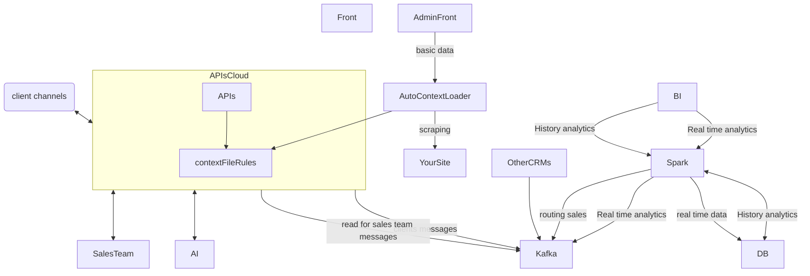

# AutopilotCRM

Goal of this project is to make open source CRM and make on that road knowledge and fun. 
That would be great portfolio for me and training, for you - the best product that you could find =) 

## Basic funcionality for Autopolit CRM: 

1. Automated customer service: Automatically respond to customer inquiries, provide personalized customer service, and manage customer relationships.

2. Lead generation: Automate the process of identifying and qualifying leads, and then routing them to the appropriate sales team or individual.

3. Sales automation: Automatically track sales activities and progress, as well as manage sales pipelines and forecasts.

4. Reporting & analytics: Generate reports on customer interactions, sales performance, and other key metrics to help inform business decisions.

5. Integration with other systems: Integrate with existing CRM systems to ensure data accuracy and consistency across platforms.

## architecture for CRM

